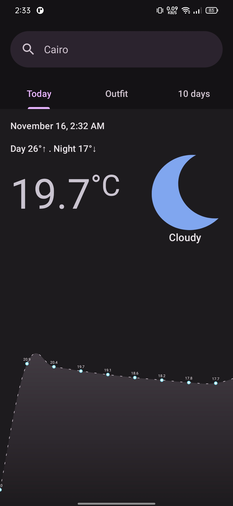
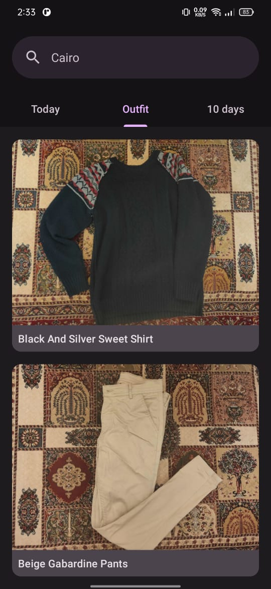
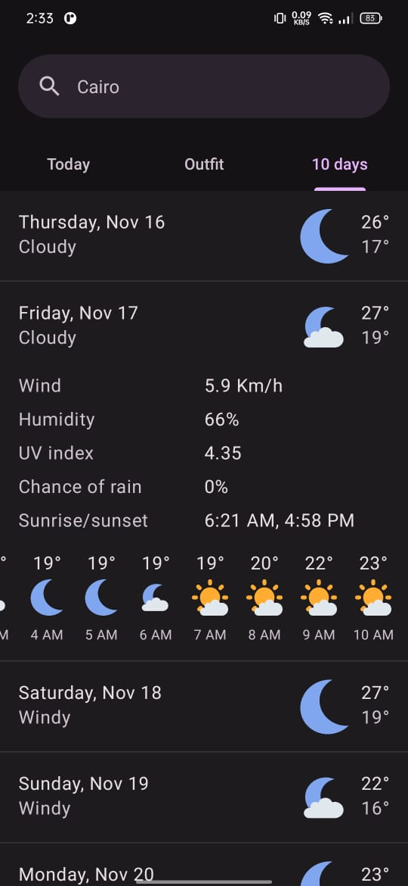

# Outfitter
An application that recommends an outfit based on weather factors. The app provides you with a detailed weather forecast for the next ten days, along with the temperature in every hour. It also displays the current day's weather.

## Features

### 1. Today's Weather
Stay up-to-date with the current weather effortlessly using the Today's Weather feature of the app. This convenient functionality ensures that you are well-informed about the weather conditions for the present day.

### 2. Daily Outfit Planning
Easily plan your outfit for the day with the app. Select clothing that suits your style and is comfortable for the next 8 hours. Say goodbye to wardrobe dilemmas!

### 3. Weather Forecast
Stay ahead of the weather with the app's detailed weather forecast for the next ten days. Get hour-by-hour temperature updates, so you can plan your outfit accordingly and be prepared for any weather changes throughout the day.

## Screenshots
  

## More

The app follows the material design 3 guidelines and has both light and dark modes.

## License

This project is licensed under the MIT License - see the [LICENSE](LICENSE) file for details.
